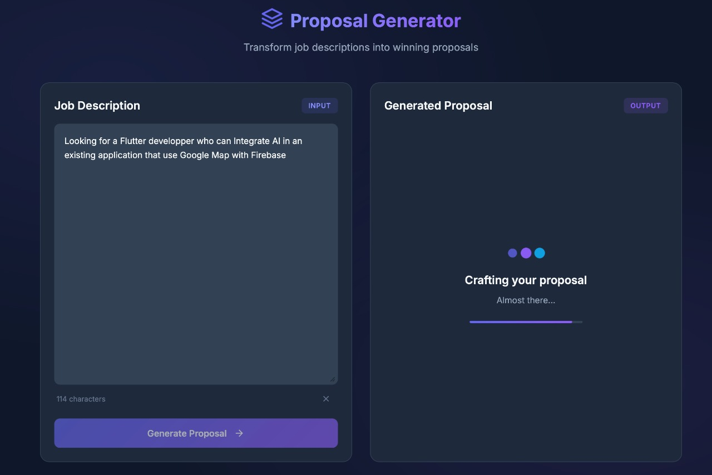
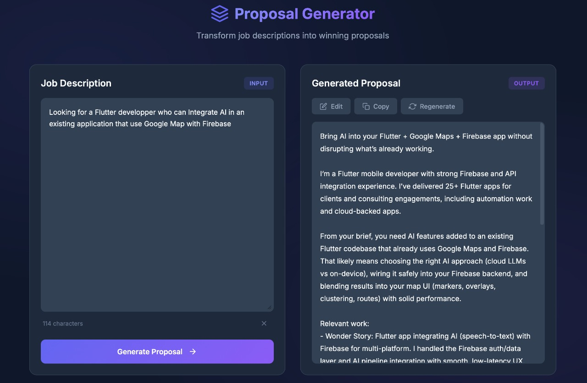

# Proposal Generator Agent
An agent that generates automatically cover messages based on previous projects, resume, and other details about the freelancer using the power of RAG with LangChain and Open AI agent SDK.

## Setup

 ### Create and activate a virtual environment:

If you don't already have UV, [install it](https://pydevtools.com/handbook/how-to/how-to-install-uv/).
Then, in the root of the project, execute the following commands:

```
uv venv
```

Once you type this command, it will show you how to activate the environment depending on the OS it can be `venv\Scripts\activate` or `source .venv/bin/activate`

2. Install dependencies:

```
pip install -r requirements.txt
```

3. Create a `.env` file in the project root (the app uses `python-dotenv` to load env vars). At minimum set the keys for whichever providers you plan to use. Example:

```
OPENAI_API_KEY=sk-...your-openai-key...
FREELANCER_NAME=Your Name
API_KEY=Put anything you want (The goal is to show that you need security in production)
```

### Initialize Data Folder
The data folder contains personal information such as projects, resume, and other relevant details that will be used by the agent to generate proposals. To set up your local data, follow these steps:

1. Create  `data` folder in the root directory of the project if it doesn't exist already.
2. Inside the `data` folder, you can group your files into subfolders for better organization.
```
Example:
data/
    ├── about-me/
    │   └── resume.pdf
    └── projects/
        └── my-app/
            └── readme.md
```
3. Create `data.json` file.
4. Populate the `data.json` file with your personal information following the structure below:

```json
[
    {
        "name": "Resume",
        "path": "data/about-me/resume.pdf",
        "type": "pdf",
        "metadata": {
            "category": "About Me"
        }
    },
    {
        "name": "My App",
        "path": "data/projects/my-app/readme.md",
        "type": "text",
        "metadata": {
            "category": "Project",
            "name": "My App",
            "purpose": "personal",
            "visibility": "private",
            "technologies": ["Python", "AI", "OpenAI", "RAG"]
        }
    },
]
```

### Setup Vector Database
After initializing your data folder, you need to create and populate the vector database that will be used by the agent for RAG (Retrieval-Augmented Generation). Follow these steps:

1. **Run the Vector Database Setup Notebook**
   Open and execute the notebook `notebooks/vector_db_settings.ipynb`. This notebook will:
   - Load all documents from your `data.json` configuration
   - Split documents into chunks for optimal retrieval
   - Generate embeddings using OpenAI's `text-embedding-3-large` model
   - Store the embeddings in a ChromaDB vector database at `chroma_db/`

   The notebook automatically processes different file types (PDF and text) and preserves metadata including categories, technologies, and other custom fields.

2. **Verify the Database**
   After running the notebook, you should see a `chroma_db/` folder in your project root. The notebook includes test cells at the end to verify the database is working correctly with similarity searches and metadata filtering.

**Note:** If you update your data files or `data.json`, you'll need to re-run the notebook to refresh the vector database. The notebook automatically deletes and recreates the database each time it runs.

### Initialize Technology List
To ensure the agent can accurately identify and extract technologies from user input, you need to set up the list of allowed technologies. Follow these steps:

1. **Run the Data Technologies Notebook**
   Open and execute the notebook `notebooks/data_technologies.ipynb`. This notebook will:
   - Execute the method `get_all_technologies` from `app_utils.py`.
   - Generate a comprehensive list of technologies that the agent can recognize.

2. **Update `agent_tools.py`**
   After running the notebook, copy the generated list of technologies and replace the existing `allowed_technologies` string in the `get_technologies` function within `agent_tools.py`. This ensures the agent uses the most up-to-date list for technology extraction.

**Note:** If you need to update the list of technologies in the future, simply re-run the notebook and update `agent_tools.py` accordingly.

### Setup Frontend configuration

To use the User Interface, you need to allow it to communicate with the backend API.

1. Create a `config.js` file in the `frontend` folder:
```javascript
const CONFIG = {
    API_KEY: "Your_Secret_Key", // Must match the API_KEY in your .env file
    API_URL: "http://localhost:8000"
};
```

2. Make sure the `API_KEY` matches the one you set in your `.env` file during the initial setup.

## Run the Application

You can run direcltly the FastAPI backend that exposes an endpoint to generate proposals.

First start the FastAPI server with the following command:
```
fastapi dev main.py
```
Then you can send a POST request to the endpoint `/generate-proposal` with a JSON body containing the job description. For example, using `curl`:

```
curl -X 'POST' \
  'http://127.0.0.1:8000/generate-proposal' \
  -H 'accept: application/json' \
  -H 'X-API-Key: The same API Key in your .env file' \
  -H 'Content-Type: application/json' \
  -d '{
  "job_description": "Your job description here"
}'
```

### Accessing the User Interface
Once the server is running (started with `fastapi dev main.py`), you can access the frontend by navigating to:
```
http://127.0.0.1:8000
```
This serves the application where you can paste job descriptions and generate proposals via a graphical interface.

## Screenshots

**Generating a proposal:**



**Generated proposal:**

